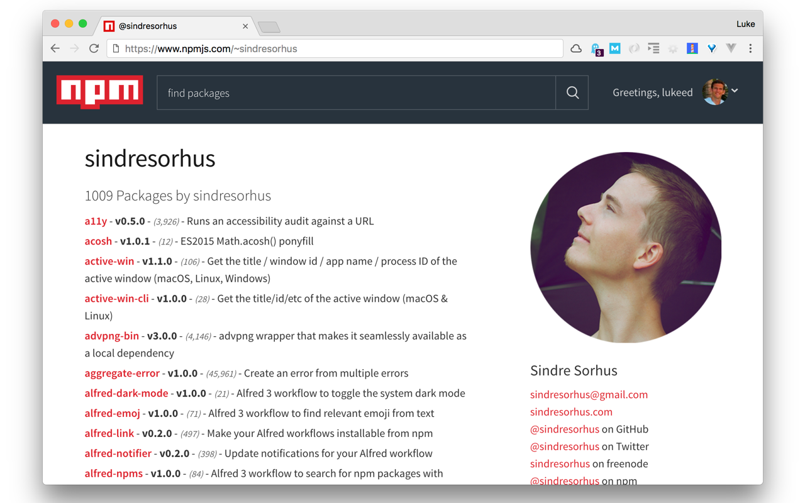
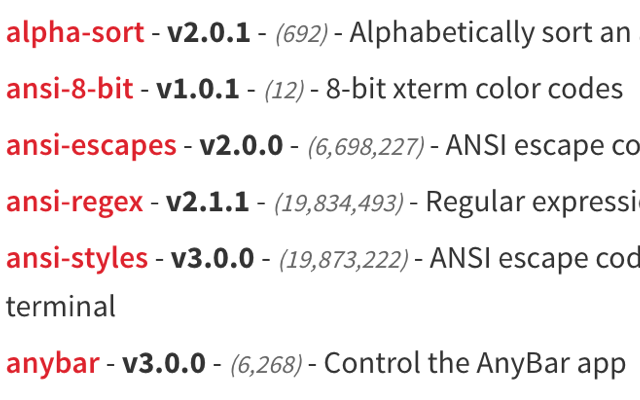

# NPM Downloads Extension

> Chrome extension that displays download counts alongside NPM author pages

When viewing any author page, this performs efficient API lookup(s) and then injects the formatted download counts next to each package name.

## Install

Install it from the [Chrome Web Store]() or [manually](http://superuser.com/a/247654/6877).

_Firefox and Safari versions TBD._

## Screenshots

## License

MIT © [Luke Edwards](https://lukeed.com)
